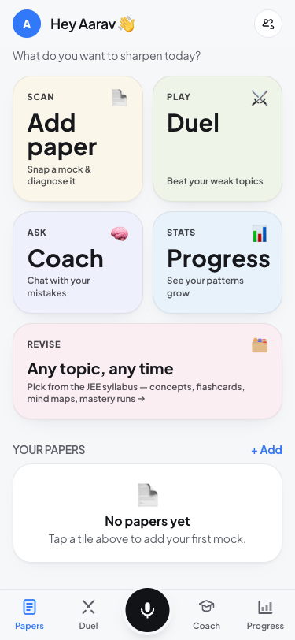
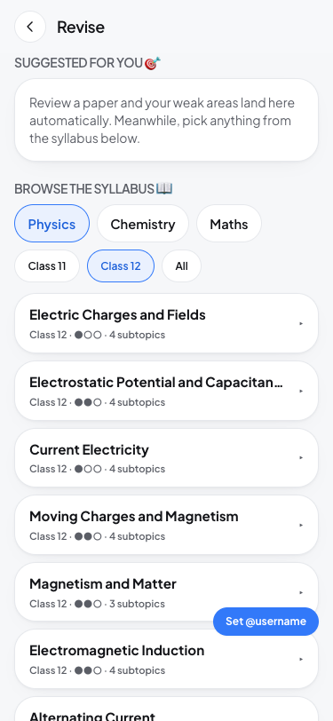
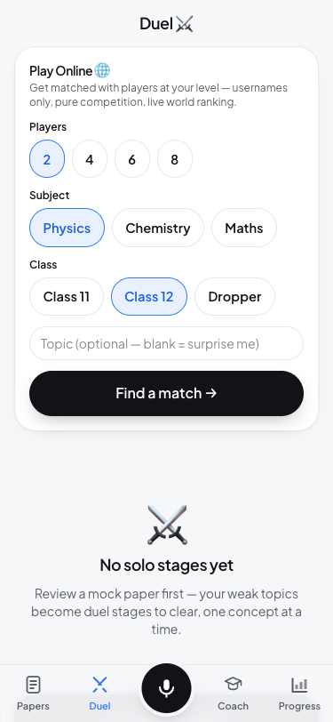

# 📄 CheckMyPaper

**See _why_ you lose marks — not just what you got wrong.**

A JEE aspirant scans a coaching mock test, taps the questions they got wrong,
guessed, or skipped, and talks through *how* they approached each one. The app
turns that into a diagnostic fingerprint of their mistake patterns — one that
compounds across every paper they log — and then closes the loop with
AI-generated revision: concepts, flashcards, mind maps, and a mastery-practice
ladder built from their own weak topics.

No coaching institute diagnoses *reasoning patterns* at scale. That's the bet.

**Live:** [checkmypaper.vercel.app](https://checkmypaper.vercel.app)

<p align="center">
  
  
  
</p>

---

## ✨ What's inside

| | |
|---|---|
| 📄 **Scan → Diagnose** | Photo/PDF of a mock → vision OCR extracts & topic-tags every question → tap your mistakes → narrate your approach by voice → self-tag the error type → one honest headline sentence per paper |
| 📊 **Progress** | Cross-paper mistake trend, recurring weak topics, "revise these next" |
| 🗂️ **Revise** | Suggested weak topics *or* browse the full JEE syllabus (chapter + subtopic) → concepts (Hinglish explanations), flashcards, mind maps — all grounded in your actual mistakes |
| 🎯 **Mastery practice** | 20-question difficulty ladder (5 easy → 10 medium → 5 hard), Timed (JEE pace, 48 min) or Zen (no clock) — one wrong answer resets the run |
| 🧠 **Coach** | "Chat with your mistakes" — a RAG tutor grounded in your own logged errors |
| ⚔️ **Duel** | 1v1 quiz battles on shared weak topics, anonymous online matchmaking, bot fallback, Elo-lite rating, leaderboards |
| 👥 **Friends** | Handles, friend requests, DM chat, friend-only squads, post-duel review with a 2-edit window |
| 🎙️ **Ask** | Voice doubt-solver — speak a question, get a spoken + visual (SVG) explanation |

Every AI feature **degrades gracefully with zero API keys** — mock data and
typed input let you click through the entire loop before wiring up a single
provider.

---

## 🚀 Run it locally

```bash
npm install
npm run dev
```

Open **http://localhost:3000**. Tap **"Try with a sample"** on the add-paper
screen to walk the whole loop instantly — no keys required.

## 🔑 Turn on the real AI

```bash
cp .env.example .env.local
```

Fill in what you have — each row degrades independently:

| Var | Powers | Fallback without it |
|---|---|---|
| `DEEPSEEK_OCR_API_KEY` | Reads paper photos/PDF pages into structured text (vision model, OpenAI-compatible) | Sample paper |
| `DEEPSEEK_API_KEY` | Topic-tagging, per-question diagnosis, paper insight, quiz/ladder generation, Revise concepts/flashcards/mind maps | Realistic student-safe mocks |
| `SARVAM_API_KEY` | Voice narration STT + spoken answers (TTS) — strong on Hindi/English code-mixed speech | Falls back to `TRANSCRIBE_API_KEY` (Whisper), then typed input |
| `VISUAL_API_KEY` | SVG diagram + explanation for the Ask feature | Text-only answer |
| `SUPABASE_URL` + `SUPABASE_SERVICE_ROLE_KEY` | Duel leaderboards, friends, chat, tutor RAG (server-only) | Simulated local rival, no social features |
| `NEXT_PUBLIC_SUPABASE_URL` + `NEXT_PUBLIC_SUPABASE_ANON_KEY` | Realtime channels (chat, squad joins, live duel standings) — anon key can *only* join broadcast channels | Polling disabled, realtime features hidden |
| `ADMIN_TOKEN` | Gates the pilot feedback review page | Feedback list route disabled |

Env changes take effect on the **next deployment/restart**, not hot-reload of
the running process.

---

## 🏗️ Architecture

```
┌─────────────────────────┐        ┌───────────────────────────┐
│   Browser (PWA)          │        │   Server (Next.js API)     │
│                          │        │                            │
│  localStorage             │──────▶│  /api/* routes             │
│  ← source of truth for    │       │  (extract, diagnose,       │
│    papers/questions/      │       │   insight, quiz, revise,    │
│    attempts/profile       │       │   tutor, social, battle)   │
│                          │        │        │           │       │
└─────────────────────────┘        │        ▼           ▼       │
                                    │   AI providers   Supabase   │
                                    │  (DeepSeek,      (service-  │
                                    │   Sarvam, ...)    role only) │
                                    └───────────────────────────┘
```

- **Local-first store** (`src/lib/store.ts`) — the device is the source of
  truth for a student's own data (papers, questions, attempts, learner
  profile). Reactive via `src/lib/useStore.ts`.
- **Server AI routes** (`src/app/api/*`) — every provider call lives here;
  each route degrades to a mock/no-op when its key is absent, never leaking
  developer-facing copy to students.
- **Supabase backend** (`src/lib/supabaseServer.ts` + `supabase/migrations/`)
  — multiplayer (duels, leaderboards, friends, chat), the tutor's pgvector
  RAG index, and pilot feedback. Accessed **only** via the service-role key
  on the server — the browser never talks to Supabase directly. The
  browser-safe anon key (`NEXT_PUBLIC_*`) is scoped to realtime broadcast
  channels only, with RLS on and zero table policies.
- **Installable PWA** — `public/manifest.webmanifest` + `public/sw.js`, works
  on Android without the Play Store.

## 🧰 Stack

**Next.js 16** (App Router) · **React 19** · **Tailwind v4** · TypeScript ·
**Supabase** (Postgres + pgvector + Realtime) · **DeepSeek** (OCR + V4 Flash
reasoning) · **Sarvam AI** (Hindi/English voice STT+TTS) · deployed on
**Vercel**.

## 📁 Project layout

```
src/
  app/            Next.js App Router pages + /api routes
    papers/       add → triage → narrate → insight
    revise/       weak-topic + syllabus browser → concepts/flashcards/mindmap/practice
    battle/       duel stages, matchmaking, review
    friends/      social — requests, chat, squads
    tutor/        RAG chat over your own mistakes
    progress/     cross-paper trend
  lib/            local store, AI clients, Supabase server client, syllabus data
supabase/
  migrations/     Postgres schema (numbered, apply in order)
llm-wiki/         architecture index for AI coding agents (see below)
```

## 🗺️ For AI coding agents

This repo keeps a living architecture index for LLM assistants at
[`llm-wiki/index.md`](llm-wiki/index.md) (routes, lib modules, data model,
env vars) and a dated changelog at [`llm-wiki/log.md`](llm-wiki/log.md).
`AGENTS.md` points here first — read it before non-trivial changes.

## 🔐 Rotating API keys

Keys live as Vercel **encrypted env vars** (production) and local
`.env.local`. Changes only take effect on a **new deployment**.

1. Create the new key with the provider (OpenRouter, Sarvam dashboard, etc).
2. Update on Vercel: Dashboard → project → Settings → Environment Variables,
   or via CLI:
   ```bash
   vercel env rm DEEPSEEK_API_KEY production -y
   printf '%s' "NEW_KEY" | vercel env add DEEPSEEK_API_KEY production
   ```
3. Mirror the change in local `.env.local`.
4. Redeploy: `vercel --prod`.
5. **Revoke the old key** in the provider dashboard.

## 🧪 Testing

```bash
npm run lint
npm run test
```

---

Built as a field-tested pilot with real JEE students. Deliberately scoped: the
diagnostic loop first, social and gamified revision layered on once the core
hypothesis — *"seeing my own mistake patterns changes what I revise"* — held up.
